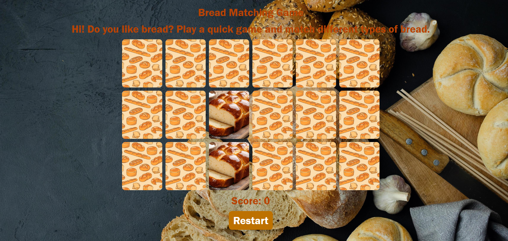

# Bread Matching Game 🍞

# Description
Matching game with different types of bread! Match the bagel to the bagel.

## How It's Made:
Tech used: 
- HTML
- CSS
- JavaScript
- Local server

## How to Use:
To use this coin game, follow these steps:
- Clone the repository: git clone https://github.com/WinnieYuDev/bread-matching-game
- Navigate to the app directory in terminal: cd app 
- Install module dependencies in terminal: npm install
- Run the server by pasting this into the terminal: node server.js
- Open your browser and launch link http://localhost:6000/

## Lessons Learned:
- Styling and Image Framing
- Using Grid in CSS
- Random logic for matching game
- Hosting app on local server

